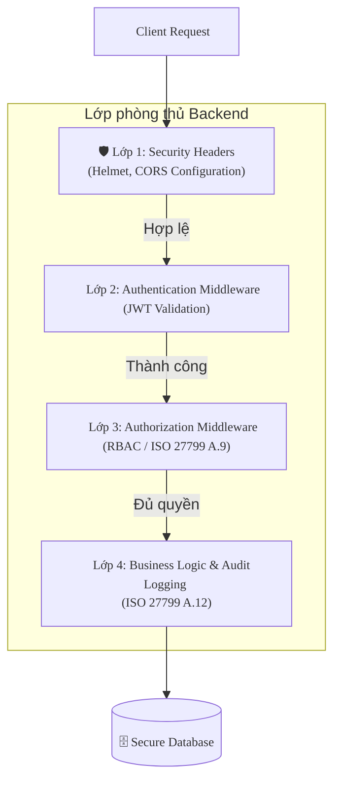

# ISO_27799_Final_Project_CMCu
Research and develop a model for securing medical information in electronic medical record systems according to ISO 27799 standards.

# Nghiên cứu và áp dụng các biện pháp kiểm soát ISO 27799 nhằm bảo mật hệ thống Bệnh án điện tử (EMR)

[](https://opensource.org/licenses/MIT)
[](https://nodejs.org)
[](https://www.iso.org/standard/83431.html)

Đồ án chuyên ngành **An toàn thông tin** tập trung vào việc **Đánh giá rủi ro và Triển khai thực tế các mục tiêu kiểm soát (Control Objectives)** theo tiêu chuẩn quốc tế **ISO 27799:2025** (Quản lý an toàn thông tin trong lĩnh vực y tế, phát triển dựa trên ISO/IEC 27002) cho lõi Backend quản lý bệnh án điện tử.

## 📌 Tổng quan & Mục tiêu Đánh giá

Hệ thống thông tin y tế chứa dữ liệu định danh cá nhân (PII) và dữ liệu sức khỏe (PHI) cực kỳ nhạy cảm. Đồ án này không chỉ xây dựng một ứng dụng CRUD thông thường, mà tập trung giải quyết bài toán: **Làm sao để một hệ thống EMR đáp ứng được các yêu cầu kiểm toán an toàn thông tin nghiêm ngặt của ISO 27799?**

### Trọng tâm nghiên cứu:
1.  **Phân tích & Đánh giá rủi ro (Risk Assessment):** Xác định các mối đe dọa đối với tính Bí mật (Confidentiality), Toàn vẹn (Integrity) và Sẵn sàng (Availability) của hồ sơ bệnh án.
2.  **Áp dụng kiểm soát (Controls Mapping):** Chi tiết hóa việc chuyển đổi các điều khoản lý thuyết của ISO 27799 thành các dòng mã lệnh (Code) và kiến trúc giải pháp cụ thể trong phân hệ Backend.


## 🛡️ Bản đồ áp dụng các biện pháp kiểm soát ISO 27799 (Controls Mapping)

Dưới đây là các nhóm kiểm soát cốt lõi của ISO 27799 đã được nhóm nghiên cứu, đánh giá rủi ro và cấu hình triển khai trực tiếp trong mã nguồn:

| Điều khoản ISO 27799 | Mục tiêu kiểm soát | Giải pháp triển khai cụ thể trong mã nguồn (Backend) |
| :--- | :--- | :--- |
| **A.5 / A.6** (Chính sách & Tổ chức) | Xác thực danh tính và phân tách nhiệm vụ rõ ràng trong môi trường y tế. | Triển khai cơ chế mã hóa **JWT (JSON Web Token)** kết hợp phân quyền **RBAC (Role-Based Access Control)** nghiêm ngặt tại `backend/middlewares/auth.js`. Phân tách rõ ràng đặc quyền giữa: *Bác sĩ, Y tá, Nhân viên hành chính và Bệnh nhân*. |
| **A.8** (Quản lý tài sản thông tin) | Phân loại dữ liệu bệnh án nhạy cảm để có mức độ bảo vệ tương ứng. | Định nghĩa rõ cấu trúc dữ liệu PHI (Protected Health Information) trong `backend/models/`. Áp dụng cơ chế **Input Sanitization** tại lớp Middleware để chống lỗi Logic phân quyền, đảm bảo nhân sự chỉ tiếp cận đúng tài sản thông tin được giao. |
| **A.9** (Kiểm soát truy cập) | Đảm bảo nguyên tắc "Quyền hạn tối thiểu" (Least Privilege) khi truy cập bệnh án. | Thiết lập các bộ lọc kiểm tra quyền sở hữu tại `backend/controllers/`. Bác sĩ chỉ có quyền xem/sửa bệnh án của bệnh nhân thuộc khoa/phòng mình phụ thuộc hoặc được hệ thống phân công/ủy quyền, chặn đứng các lỗ hổng bypass ID. |
| **A.10** (Mã hóa) | Bảo vệ tính bí mật và toàn vẹn của dữ liệu y tế nhạy cảm. | Sử dụng các thuật toán mã hóa mạnh để bảo vệ dữ liệu trạng thái tĩnh (Data-at-rest) cũng như cấu hình mã hóa token. (Cấu hình chuỗi mã hóa an toàn cao thông qua biến môi trường `JWT_SECRET`). |
| **A.12.4** (Ghi vết nhật ký - Logging) | Lưu trữ bằng chứng phục vụ công tác kiểm toán an ninh và phát hiện xâm nhập. | Triển khai phân hệ **Audit Trail / System Logging** ghi vết toàn bộ hành vi đọc/ghi/thay đổi thông tin bệnh án (Ai truy cập? Lúc nào? Xem bệnh án nào?). Nhật ký này được thiết lập ghi ra file riêng biệt, chống can thiệp ghi đè nhằm phục vụ kiểm toán ISO. |
| **A.14** (An toàn chu kỳ phát triển) | Đảm bảo API không chứa các lỗ hổng bảo mật phổ biến. | Tích hợp công cụ tài liệu hóa **Swagger UI (OpenAPI v3)** nhằm chuẩn hóa cấu trúc đầu vào/đầu ra, hỗ trợ quá trình **API Security Testing** và đánh giá kiểm thử mã nguồn (Code Review). |


## 🏗️ Kiến trúc lớp phòng thủ của hệ thống (Security Architecture)

Hệ thống Backend (Node.js/Express.js) được thiết kế theo mô hình phòng thủ theo chiều sâu (**Defense in Depth**):


## 📂 Cấu trúc thư mục định hướng An toàn thông tin

Plaintext

```
├── .idea/                  # Cấu hình môi trường phát triển
├── .vscode/                # Cấu hình chuẩn hóa code format chống rò rỉ mã nguồn
├── backend/                # Phân hệ xử lý core ứng dụng và kiểm soát an ninh
│   ├── config/             # Cấu hình Database bảo mật, biến môi trường và thiết lập CORS
│   ├── controllers/        # Triển khai logic nghiệp vụ (Kiểm tra điều kiện ràng buộc bảo mật dữ liệu)
│   ├── middlewares/        # Trọng tâm đồ án: Chứa logic xác thực, phân quyền RBAC và khử độc dữ liệu
│   ├── models/             # Định nghĩa Schema dữ liệu bệnh án theo tiêu chuẩn an toàn
│   ├── routes/             # Định tuyến API (Tất cả các Endpoint nhạy cảm đều được bảo vệ bởi middleware)
│   └── app.js              # Điểm khởi chạy hệ thống (Tích hợp các lớp bảo mật bảo vệ ứng dụng)
├── Chương 3.md             # Tài liệu Phân tích thiết kế hệ thống & Đánh giá sự tương thích với ISO 27799
├── Iso 27799-2025.pdf      # Tài liệu gốc tiêu chuẩn ISO 27799 dùng làm căn cứ đối chiếu kiểm toán
├── .gitignore              # Ngăn chặn rò rỉ các file cấu hình nhạy cảm (.env, mật khẩu, private key)
└── README.md               # Tài liệu hướng dẫn và đặc tả an toàn hệ thống
```


## 🚀 Hướng dẫn triển khai nhanh

### Yêu cầu tiên quyết

- Node.js (Phiên bản `>= 18.x`)
- npm (Phiên bản `>= 9.x`)

### Các bước cài đặt

1. **Tải mã nguồn:**
    Bash
    ```
    git clone [https://github.com/zyond26/ISO_27799_Final_Project_CMCu.git](https://github.com/zyond26/ISO_27799_Final_Project_CMCu.git)
    cd ISO_27799_Final_Project_CMCu
    ```
    
2. **Cài đặt thư viện:**
    Bash
    ```
    cd backend
    npm install
    ```
    
3. **Thiết lập biến môi trường bảo mật:** Tạo file `.env` nằm trong thư mục `/backend` để cô lập các thông tin nhạy cảm:
    Code snippet
    ```
    PORT=5000
    MONGO_URI=mongodb://localhost:27017/iso_27799_emr
    JWT_SECRET=Chuoi_Ky_Tu_Ngau_Nhien_Co_Do_Phuc_Tap_Cao_De_Ky_Token
    JWT_EXPIRE=1h
    ```
    
4. **Khởi chạy hệ thống kiểm thử:**
    Bash
    ```
    npm run dev  
    ```
